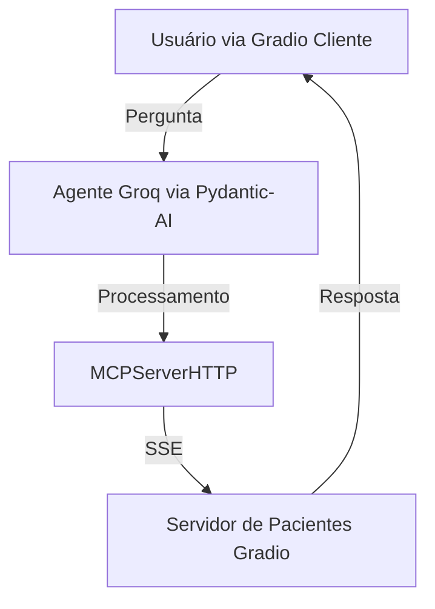

# 🏥 Sistema de Cadastro e Consulta de Pacientes com MCP e Groq Agent

Este projeto implementa um **sistema inteligente de cadastro e consulta de pacientes**, utilizando um ecossistema moderno de ferramentas de **Inteligência Artificial, Protocolo MCP (Multi-Connection Protocol)** e interfaces interativas via **Gradio**.

## 📌 Visão Geral

O sistema é composto por dois principais módulos:

1. **Servidor de Cadastro de Pacientes** (`paciente_server.py`): Responsável pelo cadastro e consulta de pacientes, com persistência via **SQLite** e validação de dados utilizando **Pydantic**.
   
2. **Cliente Médico com Integração de Agente AI** (`PydanticAI_medico_client_mcp.py`): Interface de consulta inteligente que interage com o servidor via **MCP** e processa perguntas com um **Agente Groq**.

## 🎯 Objetivos

- Prover uma solução robusta e escalável para o cadastro e consulta de pacientes.
- Demonstrar a integração entre agentes de IA e sistemas legados via MCP.
- Validar a arquitetura baseada em micro-serviços desacoplados, comunicação assíncrona e inferência com modelos LLM.

## 🛠️ Tecnologias Utilizadas

| Tecnologia                | Finalidade                                           |
| ------------------------ | --------------------------------------------------- |
| **Python 3.10+**         | Linguagem principal                                 |
| **SQLAlchemy**           | ORM para persistência de dados                      |
| **Pydantic**             | Validação e serialização de dados                    |
| **Gradio**               | Interface gráfica web para interação                 |
| **Pydantic-AI**          | Orquestração de Agentes de IA                        |
| **MCPServer (HTTP/SSE)** | Comunicação assíncrona entre cliente e servidor      |
| **Groq Agent**           | Modelo LLM para processamento de linguagem natural   |
| **SQLite**               | Banco de dados leve e embutido                       |
| **Logging**              | Rastreabilidade e monitoramento                     |

## 📂 Estrutura do Projeto

```
├── paciente_server.py               # Servidor MCP para cadastro de pacientes
├── PydanticAI_medico_client_mcp.py  # Cliente médico com integração Groq Agent
├── pacientes.db                     # Banco de dados SQLite (gerado automaticamente)
├── README.md                        # Documentação do projeto
└── requirements.txt                 # Dependências do projeto
```

## 🚀 Como Executar

### 1. Clone o Repositório

```bash
git clone https://github.com/seuusuario/seurepositorio.git
cd seurepositorio
```

### 2. Crie um Ambiente Virtual

```bash
python -m venv venv
source venv/bin/activate  # Linux/Mac
venv\Scripts\activate     # Windows
```

### 3. Instale as Dependências

```bash
pip install -r requirements.txt
```

## 🏥 Módulo 1: Servidor de Cadastro de Pacientes

### ✅ Funcionalidades:

- Cadastro de pacientes com validação de dados.
- Consulta de pacientes com verificação de duplicidade.
- Listagem completa de todos os pacientes cadastrados.
- Interface web interativa via **Gradio**.
- Comunicação via **MCP Server** com **SSE**.

### ▶️ Executar o Servidor:

```bash
python paciente_server.py
```

- O servidor será iniciado na porta `7865`.
- A interface estará disponível via navegador em: http://localhost:7865

## 🩺 Módulo 2: Cliente Médico com Integração de Agente AI

### ✅ Funcionalidades:

- Seleção dinâmica de modelos LLM.
- Consulta textual sobre pacientes utilizando **Groq Agent**.
- Comunicação assíncrona via **MCP**.
- Interface gráfica via **Gradio**.

### ▶️ Executar o Cliente:

```bash
python PydanticAI_medico_client_mcp.py
```

- O cliente será iniciado na porta `7860`.
- A interface estará disponível via navegador em: http://localhost:7860

## ⚙️ Configuração de Ambiente

- Defina a variável de ambiente `GROQ_API_KEY` com sua chave de acesso ao Groq:

```bash
export GROQ_API_KEY="sua_chave"
```

## 📡 Fluxo de Comunicação



## 📝 Exemplos de Uso

### ✅ Cadastrando um Paciente:

- Nome: João Silva
- Idade: 45
- Sintoma: Dor abdominal
- Médico: Dr. Almeida

### ✅ Consultando Pacientes:

- Utilize o cliente Gradio, enviando perguntas como:

> "Quantos pacientes estão cadastrados?"

> "Existe um paciente chamado João Silva?"

## ✅ Boas Práticas Implementadas

- **Logging estruturado** para rastreabilidade.
- **Validação de consistência** entre datas de internação e alta.
- **ThreadPoolExecutor** para garantir não-bloqueio em operações de IA.
- **Design modular** com clara separação de responsabilidades.
- **Tratamento robusto de exceções**.

## 🚧 Melhorias Futuras

- Implementar autenticação e autorização.
- Persistência de logs em sistema de arquivos.
- Deployment com Docker e Kubernetes.
- Integração com bancos de dados relacionais (PostgreSQL).

## 👨‍💻 Contribuição

Contribuições são bem-vindas! Para contribuir:

1. Fork este repositório.
2. Crie uma branch com sua feature (`git checkout -b feature/nova-feature`).
3. Commit suas alterações (`git commit -m 'Adiciona nova feature'`).
4. Push para a branch (`git push origin feature/nova-feature`).
5. Abra um Pull Request.

## 📄 Licença

Este projeto está licenciado sob a **MIT License** - consulte o arquivo [LICENSE](LICENSE) para mais detalhes.
